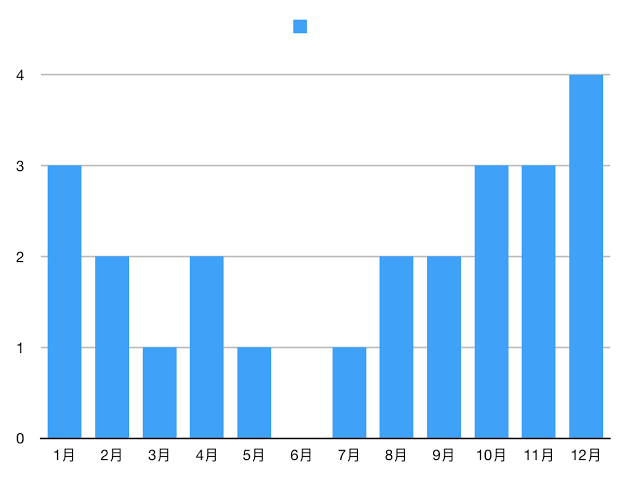

:orphan:

.. _2017movie:

2017观影记录
===================

:Publish Date: 2017-12-30

2017年马上就结束了。掐指一算，2017年看了好多电影。包括线上和线下电影院的。

线下电影院观影记录（按时间顺序，以中国大陆上映时的片名为准）：

- `星球大战外传：侠盗一号 <https://zh.wikipedia.org/wiki/%E6%98%9F%E9%9A%9B%E5%A4%A7%E6%88%B0%E5%A4%96%E5%82%B3%EF%BC%9A%E4%BF%A0%E7%9B%9C%E4%B8%80%E8%99%9F>`__ （Rogue One: A Star Wars Story）
- `太空旅客 <https://zh.wikipedia.org/wiki/%E6%98%9F%E9%9A%9B%E9%81%8E%E5%AE%A2>`__ （Passengers）
- `降临 <https://zh.wikipedia.org/zh-hans/%E9%99%8D%E4%B8%B4_(%E7%94%B5%E5%BD%B1)>`__ （Arrival）
- `极限特工：终极回归 <https://zh.wikipedia.org/wiki/%E9%99%90%E5%88%B6%E7%B4%9A%E6%88%B0%E8%AD%A6%EF%BC%9A%E9%87%8D%E8%BF%94%E6%A5%B5%E9%99%90>`__ （xXx: The Return of Xander Cage）
- `生化危机6：终章 <https://zh.wikipedia.org/wiki/%E6%83%A1%E9%9D%88%E5%8F%A4%E5%A0%A1%EF%BC%9A%E6%9C%80%E7%B5%82%E7%AB%A0>`__ （Resident Evil: The Final Chapter）
- `金刚狼3：殊死一战 <https://zh.wikipedia.org/wiki/%E7%BE%85%E6%A0%B9_(%E9%9B%BB%E5%BD%B1)>`__ （Logan）
- `攻壳机动队 <https://zh.wikipedia.org/wiki/%E6%94%BB%E6%AE%BC%E6%A9%9F%E5%8B%95%E9%9A%8A_(2017%E5%B9%B4%E9%9B%BB%E5%BD%B1)>`__ （Ghost in the Shell）
- `速度与激情8 <https://zh.wikipedia.org/zh-hans/%E7%8E%A9%E5%91%BD%E9%97%9C%E9%A0%AD8>`__ （The Fate of the Furious）
- `拆弹专家 <https://zh.wikipedia.org/wiki/%E6%8B%86%E5%BC%B9%E4%B8%93%E5%AE%B6_(%E7%94%B5%E5%BD%B1)>`__
- `大护法 <https://zh.wikipedia.org/wiki/%E5%A4%A7%E6%8A%A4%E6%B3%95>`__
- `战狼2 <https://zh.wikipedia.org/wiki/%E6%88%B0%E7%8B%BC2>`__
- `星际特工：千星之城 <https://zh.wikipedia.org/wiki/%E6%98%9F%E9%9A%9B%E7%89%B9%E5%B7%A5%E7%93%A6%E9%9B%B7%E8%AB%BE%EF%BC%9A%E5%8D%83%E6%98%9F%E4%B9%8B%E5%9F%8E>`__ （Valérian et la Cité des mille planètes）
- `看不见的客人 <https://zh.wikipedia.org/wiki/%E4%BD%88%E5%B1%80_(%E9%9B%BB%E5%BD%B1)>`__ （Contratiempo）
- `英伦对决 <https://zh.wikipedia.org/wiki/%E8%8B%B1%E5%80%AB%E5%B0%8D%E6%B1%BA>`__ （The Foreigner）
- `天才枪手 <https://zh.wikipedia.org/wiki/%E6%A8%A1%E7%8A%AF%E7%94%9F>`__ （ฉลาดเกมส์โกง）
- `王牌特工2：黄金圈 <https://zh.wikipedia.org/wiki/%E9%87%91%E7%89%8C%E7%89%B9%E5%8B%99%EF%BC%9A%E6%A9%9F%E5%AF%86%E5%B0%8D%E6%B1%BA>`__ （Kingsman: The Golden Circle）
- `全球风暴 <https://zh.wikipedia.org/wiki/%E6%B0%A3%E8%B1%A1%E6%88%B0_(%E9%9B%BB%E5%BD%B1)>`__ （Geostorm）
- `东方快车谋杀案 <https://zh.wikipedia.org/wiki/%E6%9D%B1%E6%96%B9%E5%BF%AB%E8%BB%8A%E8%AC%80%E6%AE%BA%E6%A1%88_(2017%E5%B9%B4%E9%9B%BB%E5%BD%B1)>`__ （Murder on the Orient Express）
- `雷神3：诸神黄昏 <https://zh.wikipedia.org/wiki/%E9%9B%B7%E7%A5%9E%E7%B4%A2%E7%88%BE3%EF%BC%9A%E8%AB%B8%E7%A5%9E%E9%BB%83%E6%98%8F>`__ （Thor: Ragnarok）
- `追捕 <https://zh.wikipedia.org/wiki/%E8%BF%BD%E6%8D%95_(2017%E5%B9%B4%E9%9B%BB%E5%BD%B1)>`__
- `至暗时刻 <https://zh.wikipedia.org/wiki/%E6%9C%80%E9%BB%91%E6%9A%97%E7%9A%84%E6%99%82%E5%88%BB>`__ （Darkest Hour）
- `寻梦环游记 <https://zh.wikipedia.org/wiki/%E5%AF%BB%E6%A2%A6%E7%8E%AF%E6%B8%B8%E8%AE%B0>`__ （Coco）
- `至爱梵高·星空之谜 <https://zh.wikipedia.org/wiki/%E8%87%B3%E7%88%B1%E6%A2%B5%E9%AB%98%C2%B7%E6%98%9F%E7%A9%BA%E4%B9%8B%E8%B0%9C>`__ （Loving Vincent）
- `芳华 <https://zh.wikipedia.org/wiki/%E8%8A%B3%E5%8D%8E>`__

线上观影记录（包括BT下载以及Netflix，包括电影/纪录片/部分美剧，不完全）：

- `Blade Runner <https://zh.wikipedia.org/wiki/%E9%93%B6%E7%BF%BC%E6%9D%80%E6%89%8B>`__ (1982)
- `Blade Runner 2049 <https://zh.wikipedia.org/wiki/%E9%8A%80%E7%BF%BC%E6%AE%BA%E6%89%8B2049>`__
- `Love Actually <https://zh.wikipedia.org/wiki/%E7%9C%9F%E7%88%B1%E8%87%B3%E4%B8%8A>`__
- `World War Z <https://zh.wikipedia.org/wiki/%E5%9C%B0%E7%90%83%E6%9C%AB%E6%97%A5%E6%88%B0>`__
- `Dunkirk <https://zh.wikipedia.org/wiki/%E6%95%A6%E5%85%8B%E7%88%BE%E5%85%8B%E5%A4%A7%E8%A1%8C%E5%8B%95>`__
- `Everst <https://zh.wikipedia.org/wiki/%E8%81%96%E6%AF%8D%E5%B3%B0_(%E9%9B%BB%E5%BD%B1)>`__
- `霸王别姬 <https://zh.wikipedia.org/wiki/%E9%9C%B8%E7%8E%8B%E5%88%A5%E5%A7%AC_(%E9%9B%BB%E5%BD%B1)>`__
- `Titanic <https://zh.wikipedia.org/wiki/%E6%B3%B0%E5%9D%A6%E5%B0%BC%E5%85%8B%E5%8F%B7_(1997%E5%B9%B4%E7%94%B5%E5%BD%B1)>`__
- `隧道 <https://zh.wikipedia.org/wiki/%E9%9A%A7%E9%81%93_(%E9%9B%BB%E5%BD%B1)>`__ （터널）
- `London Has Fallen <https://zh.wikipedia.org/wiki/%E5%85%A8%E9%9D%A2%E6%94%BB%E4%BD%942%EF%BC%9A%E5%80%AB%E6%95%A6%E6%95%91%E6%8F%B4>`__
- `出租车司机 <https://zh.wikipedia.org/wiki/%E6%88%91%E5%8F%AA%E6%98%AF%E5%80%8B%E8%A8%88%E7%A8%8B%E8%BB%8A%E5%8F%B8%E6%A9%9F>`__ （택시운전사）
- `Ocean's Eleven <https://zh.wikipedia.org/wiki/%E7%9B%9C%E6%B5%B7%E8%B1%AA%E6%83%85>`__
- `Ocean's Twelve <https://zh.wikipedia.org/wiki/%E7%9E%9E%E5%A4%A9%E9%81%8E%E6%B5%B72%EF%BC%9A%E9%95%B7%E9%A9%85%E7%9B%B4%E5%85%A5>`__
- `Shooter <https://zh.wikipedia.org/wiki/%E7%8B%99%E6%93%8A%E7%94%9F%E6%AD%BB%E7%B7%9A>`__
- `Knight Day <https://zh.wikipedia.org/wiki/%E9%A8%8E%E5%A3%AB%E5%87%BA%E4%BB%BB%E5%8B%99>`__
- `2001: A Space Odyssey <https://zh.wikipedia.org/wiki/2001%E5%A4%AA%E7%A9%BA%E6%BC%AB%E9%81%8A_(%E9%9B%BB%E5%BD%B1)>`__
- `Minority Report <https://zh.wikipedia.org/wiki/%E5%B0%91%E6%95%B0%E6%B4%BE%E6%8A%A5%E5%91%8A_(%E7%94%B5%E5%BD%B1)>`__
- `Deep Impact <https://zh.wikipedia.org/wiki/%E6%9C%AB%E6%97%A5%E6%95%91%E6%9C%AA%E4%BE%86>`__
- `Area 51 <https://en.wikipedia.org/wiki/Area_51_(film)>`__
- `San Andreas <https://zh.wikipedia.org/wiki/%E6%9C%AB%E6%97%A5%E5%B4%A9%E5%A1%8C>`__
- `I, Origin <https://zh.wikipedia.org/wiki/I%E5%9E%8B%E8%B5%B7%E6%BA%90>`__
- `Particle Fever <https://en.wikipedia.org/wiki/Particle_Fever>`__
- `City 40 <https://en.wikipedia.org/wiki/City_40_(film)>`__
- `Stranger Things <https://zh.wikipedia.org/wiki/%E6%80%AA%E5%A5%87%E7%89%A9%E8%AA%9E>`__
- `House Of Cards <https://zh.wikipedia.org/wiki/%E7%BA%B8%E7%89%8C%E5%B1%8B>`__, Season 1

现在回忆一下，很多电影的质量其实很一般，属于看完之后走出电影院差不多就能忘记剧情的那种。这种电影很多都是所谓的「商业大片」，追求特效和画面，完全不考虑剧情的质量和观众的观影感受。

简单分析了一下，线下观影的统计

6月居然一部都没看，是因为工作太饱和了还是因为没有好看的电影呢？